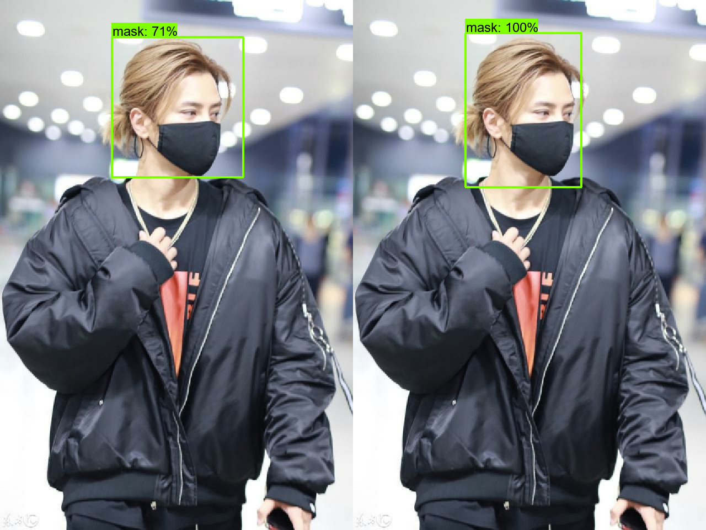

# Mask_detection_Faster_RCNN_Resnet50
In this project:
- Fine tune the Faster_RCNN_Resnet50 model from object detection model zoo on the Mask detection dataset: https://public.roboflow.com/object-detection/mask-wearing.
- [Deploy the model to AWS SageMaker endpoint.](https://github.com/Abd-elr4hman/Mask_detection_Faster_RCNN_Resnet50/blob/main/Deploy-locallyTrained-TF-OD-model.ipynb)

## Dependancies
 - Python 3.x
 - tensoflow 2.x
 - Object detection API 
 
## Test

